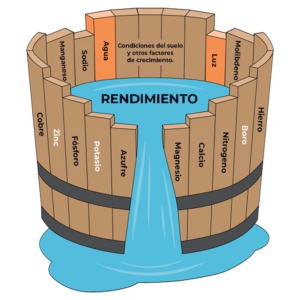
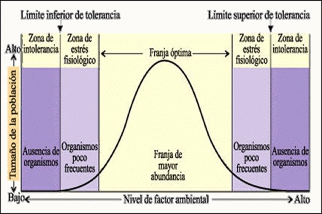

```{r setup, include=FALSE}
options(htmltools.dir.version = FALSE)
knitr::opts_chunk$set(
  fig.width = 12, 
  fig.height = 8, 
  fig.retina = 3,
  out.width = "100%",
  cache = TRUE,
  echo = FALSE,
  message = FALSE, 
  warning = FALSE,
  hiline = TRUE
)
library(ggplot2)
library(dplyr)
library(knitr)
library(ggrepel)
```

```{css, echo=FALSE}
.title-slide {
  background-image: url('fondo.jpg');
  background-size: cover;
  background-position: center;
}

.title-slide .remark-slide-content {
  background: rgba(0, 0, 0, 0.7);
  color: white;
}

.large { font-size: 130% }
.medium { font-size: 110% }
.small { font-size: 90% }
.tiny { font-size: 70% }

.green { color: #2E8B57; }
.blue { color: #4169E1; }
.red { color: #DC143C; }

.highlight {
  background-color: #ffff99;
  padding: 2px 4px;
}

.box {
  background-color: #f0f8ff;
  border: 2px solid #4169E1;
  border-radius: 10px;
  padding: 20px;
  margin: 10px 0;
}

.equation {
  background-color: #f5f5f5;
  border-left: 5px solid #2E8B57;
  padding: 15px;
  margin: 10px 0;
  font-family: 'Courier New', monospace;
}
```


# .large[🌿 Fundamentos de Ecología de Poblaciones]

## .medium[Historia, Características y Dinámica Poblacional]


---

# 📋 Agenda de la Conferencia

.box[
## **BLOQUE 1** - Historia y Desarrollo
- Evolución de la disciplina
- Pioneros y contribuciones clave
- Hitos históricos fundamentales

## **BLOQUE 2** - Características Poblacionales
- Conceptos básicos: tamaño, densidad, distribución
- Estructura etaria y demográfica
- Patrones espaciales
]

---

# 📋 Agenda de la Conferencia (cont.)

.box[
## **BLOQUE 3** - Crecimiento Poblacional
- Modelos matemáticos fundamentales
- Capacidad de carga y regulación
- Efecto Allee

## **BLOQUE 4** - Factores Reguladores
- Leyes limitantes clásicas
- Factores ambientales y distribución
]

---
class: inverse, center, middle

# 📚 BLOQUE 1
# Historia y Desarrollo de la Ecología de Poblaciones

---

# 🕰️ Línea Temporal: Desarrollo Histórico

```{r timeline, fig.height=6}
timeline_data <- data.frame(
  Year = c(1798, 1838, 1925, 1926, 1931, 1934, 1957, 1967,
            1866, 1895, 1925, 1935, 1942, 1953, 1957),
  Event = c("Malthus\nEnsayo población", "Darwin\nOrigen especies", 
            "Lotka\nBiología física", "Volterra\nEcuaciones", 
            "Allee\nAgregaciones", "Gause\nExclusión competitiva",
            "MacArthur\nBiogeografía", "Teoría r-K", 
            "Haeckel\nacuña 'ecología' (Ökologie)", "Warming\nEcología vegetal", 
            "Lotka–Volterra\n(depredador–presa)",  "Tansley\nintroduce 'ecosistema'",  
            "Lindeman\ndinámica trófica",  "E. P. Odum\nFundamentals of Ecology",  
            "Hutchinson\nnicho como hipervolumen"),
  Y = rep(1, 15)
)

ggplot(timeline_data, aes(x = Year, y = Y)) +
  geom_point(size = 4, color = "#2E8B57") +
  geom_text_repel(aes(label = Event), vjust = -1, size = 3.5, fontface = "bold") +
  geom_line(color = "#2E8B57", size = 1) +
  scale_x_continuous(breaks = timeline_data$Year, 
                     labels = timeline_data$Year) +
  theme_minimal() +
  scale_x_continuous(transform = 'log') +
  theme(axis.text.y = element_blank(),
        axis.text.x = element_text(size = 14),
        axis.title.x = element_text(size = 14),
        axis.ticks.y = element_blank(),
        panel.grid.y = element_blank(),
        plot.title = element_text(hjust = 0.5, size = 16, face = "bold")) +
  labs(title = "Hitos Fundamentales en Ecología de Poblaciones",
       x = "Año", y = "") +
  ylim(0.5, 1.5)
```

---
class: small

# 🎯 Pioneros y Contribuciones Clave

.pull-left[
### .green[Thomas Malthus (1798)]
- **"Ensayo sobre el Principio de Población"**
- Crecimiento geométrico vs. aritmético
- Base del crecimiento exponencial

### .green[Alfred Lotka (1925)]
- **"Elements of Physical Biology"**
- Matemáticas en biología
- Ecuaciones diferenciales poblacionales

### .green[Vito Volterra (1926)]
- **Modelo depredador-presa**
- Oscilaciones poblacionales
- Fundamentos de la dinámica comunitaria
]

.pull-right[
### .green[Warder Allee (1931)]
- **"Animal Aggregations"**
- Efecto Allee (densidad-dependencia positiva)
- Importancia en conservación

### .green[Georgii Gause (1934)]
- **"The Struggle for Existence"**
- Principio de exclusión competitiva
- Experimentos de laboratorio clásicos

### .green[Robert MacArthur (1967)]
- **Teoría r-K**
- Estrategias de vida
- Biogeografía de islas
]

---

class: large

# 📈 Evolución Conceptual de la Disciplina

.pull-left[
## .blue[Fase 1: Descriptiva<br>(1798-1920)]
- Observaciones naturales
- Descripciones cualitativas
- Censos poblacionales básicos

## .blue[Fase 2: Matemática<br>(1920-1950)]
- Modelos cuantitativos
- Ecuaciones diferenciales
- Teoría poblacional formal
]

.pull-left[
## .blue[Fase 3: Experimental<br>(1950-1980)]
- Validación empírica
- Experimentos controlados
- Ecología de campo

## .small.blue[Fase 4: Integrativa<br>(1980-presente)]
- Enfoque multidisciplinario
- Biología molecular + ecología
- Modelado computacional
- Aplicaciones en conservación
]

---
class: inverse, center, middle

# 🔬 BLOQUE 2
# Características de las Poblaciones

---

# 📊 Definición y Conceptos Básicos

.box[
## .green[¿Qué es una Población?]

**Definición:** Grupo de individuos de la **misma especie** que:
- Ocupan un **área geográfica y tiempo definidos**
- Interactúan entre sí (reproducción, competencia)
- Comparten un **pool genético común**
- Tienen potencial reproductivo conjunto
]

---

## 🎯 Características Fundamentales

.pull-left[
### **Propiedades Estadísticas**
- .highlight[**Tamaño (N)**]: Número total de individuos
- .highlight[**Densidad (D)**]: Individuos por unidad de área
- .highlight[**Biomasa**]: Peso estimado de la población
]

.pull-right[
### **Propiedades Dinámicas**
- .highlight[**Tasas vitales**]: Natalidad, mortalidad
- .highlight[**Tasas de movimiento**]: emigración, inmigración
- .highlight[**Estructura**]: Edad, sexo, tamaño
- .highlight[**Distribución espacial**]: Patrones geográficos
]

---

# 📏 Tamaño y Densidad Poblacional

## .blue[Tamaño Poblacional (N)]

.equation[
**N** = Número total de individuos en la población en un momento dado
]

---

## .blue[Densidad Poblacional (D)]

.pull-left[
### **Densidad Bruta**
.equation[
$$
D = N / A
$$
]
Donde:
- **N** = Tamaño poblacional  
- **A** = Área total ocupada
]

.pull-right[
### **Densidad Ecológica**
.equation[
$$
D\_{eco} = \frac{N}{A\_{util}}
$$
]

Donde:
- A<sub>util</sub> = Área de hábitat utilizable
- Más relevante biológicamente
]

---

.box[
### 🔍 **Ejemplo Práctico**
- **Población de venados:** 200 individuos en 1000 ha
- **Densidad cruda:** 0.2 venados/ha

<br>

- **Pero solo 300 ha son bosque apropiado**
- **Densidad ecológica:** 0.67 venados/ha
]

---


# 🎯 Tipos de Distribución Espacial

.pull-left[
.green[#### Distribución Aleatoria]
 
- **Sin patrón aparente**
- Ambiente homogéneo
- Sin interacciones fuertes
- **Ejemplo:** Plantas pioneras en campo abierto

.green[#### Distribución Agrupada]
- **Grupos o manchones**
- Recursos heterogéneos
- Comportamiento social
- Ejemplo: Peces en cardúmenes
]

.pull-right[
.green[#### Distribución Regular]
- **Espaciado uniforme**
- Competencia por recursos
- Territorialidad
- Ejemplo: Árboles en bosque maduro

.blue[#### Índices de Dispersión <br> Índice de Morisita]
.equation[
$$
I = n \, \frac{\left( \sum x^2 \right) - N}{N \, (N - 1)}
$$
]
- I = 1: Aleatorio
- I > 1: Agregado  
- I < 1: Uniforme
]

---

# 🗺️ Distribución Espacial

```{r spatial_patterns, fig.height=6}
# Crear datos para los tres patrones de distribución
set.seed(123)

# Patrón aleatorio
random_x <- runif(50, 0, 10)
random_y <- runif(50, 0, 10)

# Patrón agrupado
group_centers <- data.frame(x = c(2.5, 7.5, 5), y = c(7.5, 7.5, 2.5))
grouped_x <- c()
grouped_y <- c()
for(i in 1:3) {
  n_points <- c(20, 15, 15)[i]
  grouped_x <- c(grouped_x, rnorm(n_points, group_centers$x[i], 0.7))
  grouped_y <- c(grouped_y, rnorm(n_points, group_centers$y[i], 0.7))
}

# Patrón regular
regular_x <- rep(seq(1, 9, by = 2), 5)
regular_y <- rep(seq(1, 9, by = 2), each = 5)

# Combinar datos
spatial_data <- data.frame(
  x = c(random_x, grouped_x, regular_x),
  y = c(random_y, grouped_y, regular_y),
  pattern = rep(c("Aleatorio", "Agregado", "Uniforme"), 
                c(length(random_x), length(grouped_x), length(regular_x)))
)

ggplot(spatial_data, aes(x, y)) +
  geom_point(size = 2, color = "#2E8B57") +
  facet_wrap(~pattern, ncol = 3) +
  theme_minimal() +
  theme(size = 18) + 
  theme(strip.text = element_text(size = 16, face = "bold"),
        axis.title = element_text(size = 14),
        plot.title = element_text(size = 18)) +
  labs(title = "Patrones de Distribución Espacial en Poblaciones\n",
       x = "Coordenada X", y = "Coordenada Y") +
  coord_fixed()
```

---
class: small

# 📈 Interpretación de Estructuras Etarias

.pull-left[
## .red[Pirámide Expansiva]
- **Base ancha, ápice estrecho**
- Alta natalidad, alta mortalidad
- Población en crecimiento rápido
- **Características:**
  - Muchos juveniles
  - Pocos adultos mayores
  - r > 0 (crecimiento positivo)

## .blue[Pirámide Estable]  
- **Forma relativamente uniforme**
- Natalidad = Mortalidad
- Población en equilibrio
- **Características:**
  - Distribución balanceada
  - r ≈ 0 (crecimiento cero)
]

.pull-right[
## .green[Pirámide Constrictiva]
- **Base estrecha, ápice ancho**
- Baja natalidad, baja mortalidad
- Población en declive
- **Características:**
  - Pocos juveniles
  - Muchos adultos mayores
  - r < 0 (crecimiento negativo)

.box[
### 🎯 **Implicaciones para Manejo**
- **Expansiva:** Control poblacional
- **Estable:** Monitoreo continuo  
- **Constrictiva:** Programas de recuperación
]
]

---

## .blue[Pirámides Poblacionales]

```{r age_pyramids, fig.height=5, eval=F}
# Datos para diferentes tipos de pirámides poblacionales
expansive <- data.frame(
  age_group = factor(c("0-10", "11-20", "21-30", "31-40", "41-50", "51+"),
                     levels = c("0-10", "11-20", "21-30", "31-40", "41-50", "51+")),
  population = c(40, 35, 25, 15, 10, 5),
  type = "Expansiva"
)

stable <- data.frame(
  age_group = factor(c("0-10", "11-20", "21-30", "31-40", "41-50", "51+"),
                     levels = c("0-10", "11-20", "21-30", "31-40", "41-50", "51+")),
  population = c(20, 20, 20, 20, 15, 10),
  type = "Estable"
)

constrictive <- data.frame(
  age_group = factor(c("0-10", "11-20", "21-30", "31-40", "41-50", "51+"),
                     levels = c("0-10", "11-20", "21-30", "31-40", "41-50", "51+")),
  population = c(5, 10, 15, 25, 30, 35),
  type = "Constrictiva"
)

pyramid_data <- rbind(expansive, stable, constrictive)

ggplot(pyramid_data, aes(x = age_group, y = population, fill = type)) +
  geom_col() +
  facet_wrap(~type, ncol = 3) +
  scale_fill_manual(values = c("#FF6B6B", "#4ECDC4", "#45B7D1")) +
  theme_minimal() +
  theme(legend.position = "none", text = element_text(size = 16)) +
  labs(title = "Tipos de Estructuras Etarias Poblacionales",
       x = "Grupo Etario", y = "Porcentaje de la Población")
```

# 👥 Estructura Etaria y Demográfica

```{r age_pyramids2, fig.height=5}
library(tidyverse)

# --- 1) Datos base (como los que ya tenías) -------------------------------
niveles_edad <- c("0-10","11-20","21-30","31-40","41-50","51+")
expansive <- tibble(
  age_group = factor(niveles_edad, levels = niveles_edad),
  population = c(40, 35, 25, 15, 10, 5),
  type = "Expansiva"
)
stable <- tibble(
  age_group = factor(niveles_edad, levels = niveles_edad),
  population = c(20, 20, 20, 20, 15, 10),
  type = "Estable"
)
constrictive <- tibble(
  age_group = factor(niveles_edad, levels = niveles_edad),
  population = c(5, 10, 15, 25, 30, 35),
  type = "Constrictiva"
)

pyramid_data <- bind_rows(expansive, stable, constrictive)

# --- 2) Reparto por sexo (ajústalo si quieres un patrón "típico") ---------
# # Opción A (neutral, simple): 50/50 en todos los grupos
# sex_share <- tibble(
#   age_group = factor(niveles_edad, levels = niveles_edad),
#   male_share = c(0.50, 0.50, 0.50, 0.50, 0.50, 0.50)
# )

# Opción B (más "típica"): leve mayoría masculina en jóvenes y femenina en mayores
sex_share <- tibble(
  age_group = factor(niveles_edad, levels = niveles_edad),
  male_share = c(0.6, 0.51, 0.50, 0.49, 0.48, 0.4)
)

# --- 3) Expandir a hombres/mujeres y preparar valores (negativo = hombres) --
df <- pyramid_data %>%
  left_join(sex_share, by = "age_group") %>%
  mutate(
    male_pop   = population * male_share,
    female_pop = population * (1 - male_share)
  ) %>%
  select(type, age_group, male_pop, female_pop) %>%
  pivot_longer(cols = c(male_pop, female_pop),
               names_to = "sex", values_to = "pop") %>%
  mutate(
    sex  = recode(sex,
                  male_pop = "Hombres ♂",
                  female_pop = "Mujeres ♀"),
    yval = if_else(sex == "Hombres ♂", -pop, pop)   # izquierda hombres
  )

# Límite simétrico para que quede centrada
y_lim <- max(abs(df$yval)) * 1.15

# Etiquetas ♂/♀ en los extremos de cada facet
labels <- tibble(
  type = unique(df$type),
  xlab = factor(tail(niveles_edad, 1), levels = niveles_edad),  # fila superior (51+)
  left_y  = -0.92 * y_lim,
  right_y =  0.92 * y_lim
)

# --- 4) Gráfico: pirámide por tipo, color por grupo etario -----------------
ggplot(df, aes(x = age_group, y = yval, fill = age_group)) +
  geom_col(width = 0.9) +
  coord_flip() +
  facet_wrap(~ type, nrow = 1) +
  # eje con valores absolutos
  scale_y_continuous(labels = ~abs(.), limits = c(-y_lim, y_lim)) +
  scale_fill_brewer(palette = "Spectral", name = "Grupo etario") +
  # Etiquetas de lado (hombres/mujeres) por panel
  geom_text(data = labels, aes(x = xlab, y = left_y, label = "♂"),
            inherit.aes = FALSE, hjust = 0, fontface = "bold", size = 8) +
  geom_text(data = labels, aes(x = xlab, y = right_y, label = "♀"),
            inherit.aes = FALSE, hjust = 1, fontface = "bold", size = 8) +
  labs(
    title = "Pirámides Poblacionales por Tipo",
    x = "Grupo etario",
    y = "Porcentaje de la población"
  ) +
  theme_minimal(base_size = 20) +
  theme(
    legend.position = "bottom",
    text = element_text(size = 20)
    # strip.text = element_text(face = "bold")
  )
```

---
class: inverse, center, middle

# 📊 BLOQUE 3
# Crecimiento Poblacional

---

# 🚀 Modelo de Crecimiento Exponencial

## .blue[Ecuación Fundamental]

.equation[
$$
dN/dt = rN
$$

Donde:
- **N** = Tamaño poblacional
- **t** = Tiempo
- **r** = Tasa intrínseca de crecimiento
- **dN/dt** = Cambio en el tamaño poblacional
]

---

## .blue[Solución de la Ecuación]

.equation[
$$
N(t) = N\_0e^{rt}
$$

Donde:
- **N** = Tamaño poblacional
- **t** = Tiempo
- **r** = Tasa intrínseca de crecimiento
- **N<sub>0</sub>** = Población inicial
- **e** = Base del logaritmo natural (2.718...)
]

---

# 📈 Visualización del Crecimiento Exponencial

```{r exponential_growth, fig.height=6}
# Parámetros para el crecimiento exponencial
t <- seq(0, 10, by = 0.1)
N0 <- 10

# Diferentes tasas de crecimiento
r_values <- c(0.1, 0.2, 0.3, 0.4)
colors <- c("#FF6B6B", "#4ECDC4", "#45B7D1", "#96CEB4")

# Crear dataframe
exp_data <- data.frame()
for(i in 1:length(r_values)) {
  N_t <- N0 * exp(r_values[i] * t)
  temp_data <- data.frame(
    time = t,
    population = N_t,
    r_value = paste("r =", r_values[i])
  )
  exp_data <- rbind(exp_data, temp_data)
}

ggplot(exp_data, aes(x = time, y = population, color = r_value)) +
  geom_line(size = 2) +
  scale_color_manual(values = colors) +
  scale_y_log10() +
  theme_minimal() +
  theme(legend.title = element_blank(),
        text = element_text(size = 18),
        # legend.text = element_text(size = 12),
        plot.title = element_text(size = 16, face = "bold", hjust = 0.5)) +
  labs(title = "Crecimiento Poblacional Exponencial",
       subtitle = "N₀ = 10 individuos",
       x = "Tiempo", 
       y = "Tamaño Poblacional (escala log)")
```

---

# ⚖️ Modelo de Crecimiento Logístico

## .blue[Limitaciones del Modelo Exponencial]

.box[
- **Recursos infinitos** (irrealista)
- **Sin competencia** intraespecífica
- **Ambiente constante**
- **Crecimiento sin límites**
]

---

## .blue[Ecuación Logística]

.equation[
$$
dN/dt = rN(1 - N/K)
$$

Donde:
- **N** = Tamaño poblacional
- **t** = Tiempo
- **r** = Tasa intrínseca de crecimiento
- **N<sub>0</sub>** = Población inicial
- **K** = Capacidad de carga del ambiente
- **(1 - N/K)** = Factor de resistencia ambiental
]

--

## .blue[Solución de la Ecuación Logística]

.equation[
$$
N(t) = \frac{K}{(1 + ((K-N₀)/N\_0)e^{-rt})}
$$
]

---

# 📊 Comparación: Exponencial vs. Logístico

```{r logistic_comparison, fig.height=6}
# Parámetros
t <- seq(0, 20, by = 0.1)
N0 <- 5
r <- 0.3
K <- 100

# Crecimiento exponencial
N_exp <- N0 * exp(r * t)

# Crecimiento logístico
N_log <- K / (1 + ((K - N0) / N0) * exp(-r * t))

# Crear dataframe
growth_data <- data.frame(
  time = rep(t, 2),
  population = c(N_exp, N_log),
  model = rep(c("Exponencial", "Logístico"), each = length(t))
)

# Limitar exponencial para visualización
growth_data$population[growth_data$model == "Exponencial" & growth_data$population > 200] <- NA

ggplot(growth_data, aes(x = time, y = population, color = model)) +
  geom_line(size = 2) +
  geom_hline(yintercept = K, linetype = "dashed", color = "red", size = 1) +
  annotate("text", x = 15, y = K + 10, label = "Capacidad de Carga (K)", 
           color = "red", size = 4, fontface = "bold") +
  scale_color_manual(values = c("#FF6B6B", "#4ECDC4")) +
  theme_minimal() +
  theme(legend.title = element_blank(),
        # legend.text = element_text(size = 12),
        text = element_text(size = 18),
        plot.title = element_text(size = 16, face = "bold", hjust = 0.5)) +
  labs(title = "Comparación de Modelos de Crecimiento Poblacional",
       subtitle = "N₀ = 5, r = 0.3, K = 100",
       x = "Tiempo", 
       y = "Tamaño Poblacional")
```

---

# 🎯 Fases del Crecimiento Logístico

```{r logistic_phases, fig.height=5.5}
# Datos para las fases del crecimiento logístico
t <- seq(0, 20, by = 0.1)
N0 <- 5
r <- 0.3
K <- 100
N_log <- K / (1 + ((K - N0) / N0) * exp(-r * t))

# Crear dataframe con fases
phases_data <- data.frame(
  time = t,
  population = N_log
)

# Definir las fases
phases_data$phase <- ifelse(phases_data$population < K * 0.1, "Fase Lag",
                     ifelse(phases_data$population < K * 0.9, "Fase Exponencial", 
                            "Fase Equilibrio"))

ggplot(phases_data, aes(x = time, y = population)) +
  geom_line(size = 2, color = "#2E8B57") +
  geom_hline(yintercept = K, linetype = "dashed", color = "red", size = 1) +
  geom_hline(yintercept = K/2, linetype = "dotted", color = "blue", size = 1) +
  # Agregar anotaciones para las fases
  annotate("rect", xmin = 0, xmax = 3, ymin = -5, ymax = 15, 
           alpha = 0.2, fill = "yellow") +
  annotate("rect", xmin = 3, xmax = 12, ymin = 15, ymax = 90, 
           alpha = 0.2, fill = "orange") +
  annotate("rect", xmin = 12, xmax = 20, ymin = 90, ymax = 105, 
           alpha = 0.2, fill = "lightblue") +
  annotate("text", x = 1.5, y = 115, label = "FASE LAG\n(Crecimiento lento)", 
           fontface = "bold", hjust = 0.5, size = 5) +
  annotate("text", x = 7.5, y = 115, label = "FASE EXPONENCIAL\n(Crecimiento rápido)", 
           fontface = "bold", hjust = 0.5, size = 5) +
  annotate("text", x = 16, y = 115, label = "FASE EQUILIBRIO\n(Estabilización)", 
           fontface = "bold", hjust = 0.5, size = 5) +
  annotate("text", x = 15, y = K + 5, label = "K (Capacidad de Carga)", 
           color = "red", fontface = "bold", size = 4) +
  annotate("text", x = 15, y = K/2 + 5, label = "K/2 (Punto de inflexión)", 
           color = "blue", fontface = "bold", size = 4) +
  theme_minimal() +
  theme(
    text = element_text(size = 20),
    plot.title = element_text(size = 22, face = "bold", hjust = 0.5)) +
  labs(title = "Fases del Crecimiento Logístico",
       x = "Tiempo", 
       y = "Tamaño Poblacional") +
  ylim(-5, 120)
```

---

# ⚡ Efecto Allee

## .blue[Definición]
.box[
**Relación positiva entre densidad poblacional y fitness individual**

En poblaciones **muy pequeñas**, el crecimiento per cápita **disminuye** debido a:
- Dificultad para encontrar pareja
- Pérdida de beneficios cooperativos  
- Depresión endogámica
- Efectos estocásticos
]

---

## .blue[Modelo Matemático con Efecto Allee]

.equation[
$$
dN/dt = rN\frac{1 - (N/K)}{(N/A) - 1}
$$

Donde:
- **N** = Tamaño poblacional
- **t** = Tiempo
- **r** = Tasa intrínseca de crecimiento
- **N<sub>0</sub>** = Población inicial
- **K** = Capacidad de carga del ambiente
- **A** = Tamaño poblacional umbral mínimo
- Si N < A → dN/dt < 0 (extinción)
- Si A < N < K → dN/dt > 0 (crecimiento)
]

---

# 📉 Visualización del Efecto Allee

```{r allee_effect, fig.height=6}
# Parámetros para el efecto Allee
N <- seq(0, 120, by = 1)
r <- 0.1
K <- 100
A <- 20  # Umbral de Allee

# Tasa de crecimiento per cápita sin Allee
rate_normal <- r * (1 - N/K)

# Tasa de crecimiento per cápita con Allee
rate_allee <- r * (1 - N/K) * (N/A - 1)

# Crear dataframe
allee_data <- data.frame(
  population = rep(N, 2),
  growth_rate = c(rate_normal, rate_allee),
  model = rep(c("Sin Efecto Allee", "Con Efecto Allee"), each = length(N))
)

ggplot(allee_data, aes(x = population, y = growth_rate, color = model)) +
  geom_line(size = 2) +
  geom_hline(yintercept = 0, linetype = "dashed", color = "black") +
  geom_vline(xintercept = A, linetype = "dotted", color = "red", size = 1) +
  geom_vline(xintercept = K, linetype = "dotted", color = "blue", size = 1) +
  annotate("text", x = A + 5, y = 0.05, label = "Umbral Allee", 
           color = "red", angle = 90, fontface = "bold", size = 6) +
  annotate("text", x = K + 5, y = 0.05, label = "Capacidad Carga", 
           color = "blue", angle = 90, fontface = "bold", size = 6) +
  scale_color_manual(values = c("#FF6B6B", "#4ECDC4")) +
  theme_minimal() +
  theme(legend.title = element_blank(),
        legend.position = "top",
        text = element_text(size = 20),
        plot.title = element_text(size = 20, face = "bold", hjust = 0.5)) +
  labs(title = "Efecto Allee en el Crecimiento Poblacional",
       x = "Tamaño Poblacional (N)", 
       y = "Tasa de Crecimiento per cápita (dN/dt)/N")
```

---
class: small

# 🌍 Importancia Efecto Allee en Conservación

.pull-left[
## .red[Consecuencias Críticas]

### **Vórtice de Extinción**
- Poblaciones pequeñas → fitness reducido
- Fitness reducido → población más pequeña
- **Retroalimentación positiva hacia extinción**

### **Umbrales de Viabilidad**
- Población mínima viable (PMV)
- Por debajo del umbral = extinción inevitable
- **Fundamental para planes de recuperación**
]

.pull-right[
## .green[Ejemplos Reales]

- **Paloma Migratoria**
  - Comportamiento gregario obligado
  - Extinción por debajo del umbral social

- **Rinoceronte de Java**
  - < 80 individuos actuales
  - Dificultad para encontrar pareja

- **Plantas con Polinización Especializada**
  - Baja densidad → polinización insuficiente
  - **Fragmentación de hábitat crítica**

.box[
🎯 **Implicación para el manejo**
  - Restaurar poblaciones por **encima** del umbral de Allee
]
]

---
class: inverse, center, middle

# ⚖️ BLOQUE 4
# Factores que Regulan las Poblaciones

---

# 🔬 Leyes Limitantes Clásicas

## .blue[1. Ley del Mínimo de Liebig (1840)]

.pull-left[
**"El crecimiento está limitado por el factor menos disponible"**

### Analogía del Barril:
- Cada tabla = un recurso diferente
- **Tabla más corta** determina la capacidad total
- No importa cuán abundantes sean otros recursos
]



---

.equation[
**Factor Limitante** = min{R₁, R₂, R₃, ..., Rₙ}
]

### 🌱 **Ejemplos Específicos:**

.pull-left.small[
### **Plantas Acuáticas**
- **Agua abundante:** ✅ 100%
- **Luz solar:** ✅ 90%
- **CO₂:** ✅ 85%
- **Nitrógeno:** ⚠️ **30%** ← LIMITANTE
- **Fósforo:** ✅ 70%

**Resultado:** Crecimiento limitado al 30%
]

.pull-right.small[
### **Cultivo de Café (RD)**
- **Temperatura:** ✅ Óptima
- **Precipitación:** ✅ Adecuada
- **Suelo orgánico:** ✅ Rico
- **Potasio:** ⚠️ **DEFICIENTE** ← LIMITANTE
- **Mano de obra:** ✅ Disponible

**Resultado:** Rendimiento bajo por falta de K
]

---

### 🔍 **Caso Práctico: Bosque Nublado Sierra de Bahoruco**
.box.compact[
- **Humedad:** 95% (abundante)
- **Temperatura:** Ideal para crecimiento
- **Suelo profundo:** Disponible
- **Radiación solar:** **LIMITADO por nubes** ← FACTOR MÍNIMO
- **Nutrientes:** Moderados

**Consecuencia:** La vegetación se adapta a **baja luminosidad**, determinando la estructura del bosque.
]

---


## .blue[2. Ley de la Tolerancia de Shelford (1913)]
**"La supervivencia y crecimiento dependen de un rango de tolerancia"**

#### Concepto clave:
- Cada especie tiene **mínimo**, **óptimo** y **máximo** para cada factor ambiental
- Tanto la **deficiencia** como el **exceso** pueden limitar
- El óptimo varía según etapa de vida y condiciones



---

.equation[
**Rendimiento** ∝ f(Rango de tolerancia)
]

### 🌱 **Ejemplos Específicos:**

.pull-left.small[
### **Manglares (RD)**
- **Salinidad baja:** ❌ Limita crecimiento
- **Salinidad óptima:** ✅ Máximo desarrollo
- **Salinidad alta:** ⚠️ Estrés osmótico

**Resultado:** Distribución restringida a zonas costeras intermedias
]

.pull-right.small[
### **Pino Criollo (Sierra de Bahoruco)**
- **Suelo no óptimo para el pino (suelo rico para otras plantas distintas de pino):** ⚠️ Crecimiento lento, mucha competencia
- **Suelo óptimo para el pino (suelo pobre para otras plantas):** ✅ Desarrollo máximo

**Resultado**: En áreas de suelo pobre para otras plantas, el pino aprovecha ese nicho con menor competencia.
]

---

### 🔍 **Caso Práctico: Arrecifes Coralinos**
.box.compact[
- **Temperatura:** Óptima entre 23–29 °C
- **Luz:** Necesaria para simbiosis con zooxantelas
- **pH:** Afectado por acidificación oceánica
- **Tolerancia estrecha:** Vulnerables a cambios leves

**Consecuencia:** Blanqueamiento masivo con aumentos de temperatura fuera del rango.
]

