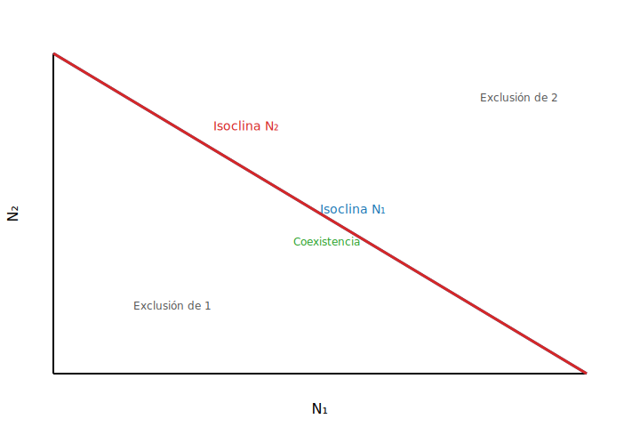
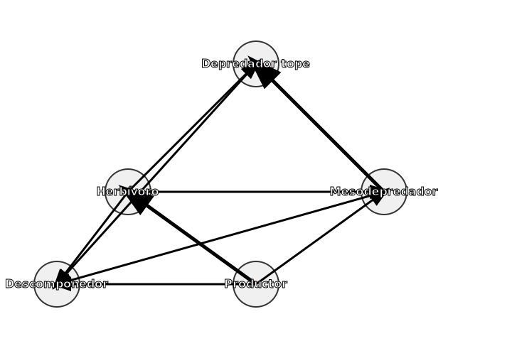

class: center, middle, inverse

# Unidad 2  
## Interacciones biológicas y dinámica poblacional
<span class="subtitle">Basada en <em>Smith &amp; Smith</em> y <em>Odum–Barrett</em></span>

---

layout: true
class: animated, fadeIn

---

<!-- Minimal look & feel (sin xaringanExtra) -->
<style>
.title-slide {
  background-image: url('fondo.jpg');
  background-size: cover;
  background-position: center;
}
.remark-slide-content {
  font-size: 20px;
  line-height: 1.4;
  <!-- font-family: "Inter", "Helvetica Neue", Arial, sans-serif; -->
}
.small { font-size: 80%; }
.tiny { font-size: 70%; }
.kpi { font-size: 140%; font-weight: 700; }
.twocol { display: grid; grid-template-columns: 1fr 1fr; gap: 1.2rem; align-items: start; }
.note { color:#555; font-style: italic; }
blockquote { border-left: 4px solid #999; padding-left: 0.8rem; color:#444; }
</style>

## Objetivos de aprendizaje

- Definir **estrategias de vida** (*r/K*) y rasgos de historia de vida.
- Distinguir **competencia intra/interespecífica**, **exclusión competitiva** y **coexistencia**.
- Reconocer **relaciones ecológicas** (depredación, mutualismo, etc.) y su modelado.
- Interpretar **modelos de crecimiento** y **metapoblaciones**.
- Explicar **redes/cascadas tróficas**, **especies clave** y **coevolución**.
- Describir **sucesión ecológica** y **fragmentación**.
- Conocer **métodos de censo** (recuentos, CMR, tablas de vida).

---

## Mapa de la unidad

1. Estrategias de vida (*r/K*) e historias de vida  
2. Competencia y coexistencia (LV)  
3. Depredación, parasitismo y enfermedades (LV + extensiones)  
4. Redes tróficas, cascadas, especies clave  
5. Dinámica de poblaciones y metapoblaciones  
6. Migración, dispersión y fragmentación  
7. Sucesión ecológica  
8. Censo poblacional y tablas de vida

---

class: inverse, center, middle
# 1) Estrategias de vida e historias de vida

---

### Rasgos y trade-offs

- Madurez sexual **temprana vs. tardía**
- Fecundidad **alta vs. baja**
- **Semélparas** vs. **iteróparas**
- **Inversión parental** por cría
- **Supervivencia** vs. **reproducción**

> Enfoque moderno: **continuos** de historia de vida (no dicotomías rígidas).

---

### r/K (heurística clásica)

- **r-estrategas**: fecundidad alta, inversión baja, ambientes variables.
- **K-estrategas**: fecundidad baja, inversión alta, ambientes estables.
- **Discusión**: ejemplos locales (malezas vs. árboles longevos; roedores vs. primates).

---

class: inverse, center, middle
# 2) Competencia y coexistencia

---

### Conceptos clave

- **Intra** vs. **interespecífica** (−, −)
- **Explotación** vs. **interferencia**
- **Exclusión competitiva** (Gause)
- **Partición de nicho** y segregación de recursos

---

### LV Competencia: ecuaciones

$$\frac{{dN_1}}{{dt}} = r_1 N_1\left(1 - \frac{{N_1 + \alpha_{{12}} N_2}}{{K_1}}\right)$$
$$\frac{{dN_2}}{{dt}} = r_2 N_2\left(1 - \frac{{N_2 + \alpha_{{21}} N_1}}{{K_2}}\right)$$

- Casos: exclusión 1, exclusión 2, coexistencia estable, coexistencia inestable.
- Coexistencia si **intra > inter**.

---

### Isoclinas (ilustración)



Diagrama cualitativo: ajustar $\alpha$ cambia pendientes y estabilidad.

---

### Mini-demo (R): isoclinas y fase (competencia)

.small[
```r
# eval=FALSE  # activa para correr la demo
params <- list(r1=0.5, r2=0.4, K1=600, K2=500, a12=0.5, a21=0.6)
isoclinas <- function(p) {
  with(p, {
    n2 <- seq(0, K2, length.out=200)
    n1_iso <- pmax(0, K1 - a12*n2)
    n1 <- seq(0, K1, length.out=200)
    n2_iso <- pmax(0, K2 - a21*n1)
    plot(n1, n1*0, type='n', xlim=c(0,K1), ylim=c(0,K2),
         xlab='N1', ylab='N2')
    lines(n1, n2_iso, col=2, lwd=2)
    lines(n1_iso, n2, col=4, lwd=2)
    legend('topright', c('Isoclina N2','Isoclina N1'), col=c(2,4), lwd=2, bty='n')
  })
}
isoclinas(params)
```
]

---

class: inverse, center, middle
# 3) Depredación, parasitismo y enfermedad

---

### LV Depredador–presa

$$
\frac{dN}{dt}= rN - aNP, \quad
\frac{dP}{dt}= baNP - mP
$$

- Ciclos presa–depredador.
- Modificaciones: **respuesta funcional** (I–III), **refugios**, **saturación**.

---

### Mini-demo (R): trayectoria LV

.small[
```r
# eval=FALSE
library(deSolve)
lv <- function(t, y, p) {
  N <- y[1]; P <- y[2]
  with(as.list(p), {
    dN <- r*N - a*N*P
    dP <- b*a*N*P - m*P
    list(c(dN, dP))
  })
}
p <- c(r=0.7, a=0.01, b=0.1, m=0.4)
y0 <- c(N=40, P=9)
tt <- seq(0, 200, by=0.5)
out <- as.data.frame(ode(y=y0, times=tt, func=lv, parms=p))
plot(out$N, out$P, type='l', xlab='N', ylab='P')
```
]

---

class: inverse, center, middle
# 4) Redes tróficas, cascadas y especies clave

---

### Red trófica (esquema)



.note[Remoción del depredador tope → **cascada** sobre herbívoros y productores.]

---

### Mini-demo (R): cadena simple con choque

.small[
```r
# eval=FALSE
t <- 1:200
P <- numeric(200); H <- P; A <- P
P[1] <- 100; H[1] <- 40; A[1] <- 10
for (i in 2:200) {
  P[i] <- max(0, P[i-1] + 0.4*P[i-1]*(1 - P[i-1]/200) - 0.02*H[i-1])
  H[i] <- max(0, H[i-1] + 0.1*H[i-1]*P[i-1]/(50+P[i-1]) - 0.05*A[i-1])
  A[i] <- max(0, A[i-1] + 0.08*A[i-1]*H[i-1]/(40+H[i-1]) - 0.06*A[i-1])
  if (i==100) A[i] <- A[i]*0.1  # remoción de depredador
}
matplot(t, cbind(P,H,A), type='l', lwd=2, lty=1, xlab='t', ylab='Biomasa')
legend('topright', c('Productores','Herbívoros','Depredador'), col=1:3, lwd=2, bty='n')
```
]

---

class: inverse, center, middle
# 5) Dinámica de poblaciones y metapoblaciones

---

### Crecimiento básico

**Geométrico**: $N_{t+1}=\lambda N_t$  
**Exponencial**: $dN/dt=rN\Rightarrow N(t)=N_0e^{rt}$  
**Logístico**: $dN/dt=rN(1-N/K)$

---

### Mini-demo (R): logístico y sensibilidad a r y K

.small[
```r
# eval=FALSE
logistic <- function(N0=10, r=0.6, K=200, tmax=50){
  N <- numeric(tmax); N[1] <- N0
  for (t in 2:tmax) N[t] <- N[t-1] + r*N[t-1]*(1 - N[t-1]/K)
  N
}
t <- 1:60
plot(t, logistic(r=0.4), type='l', lwd=2, ylim=c(0,210), xlab='t', ylab='N')
lines(t, logistic(r=0.8), lwd=2, col=2)
lines(t, logistic(r=0.6, K=150), lwd=2, col=4)
legend('bottomright', c('r=0.4, K=200','r=0.8, K=200','r=0.6, K=150'),
       col=c(1,2,4), lwd=2, bty='n')
```
]

---

### Metapoblaciones (Levins)

$$
\frac{dp}{dt}=c\,p(1-p)-e\,p,\qquad p^*=1-\frac{e}{c}\ (c>e)
$$

.small[
```r
# eval=FALSE
levins <- function(p0=0.3, c=0.4, e=0.2, tmax=100){
  p <- numeric(tmax); p[1] <- p0
  for (t in 2:tmax) p[t] <- p[t-1] + c*p[t-1]*(1-p[t-1]) - e*p[t-1]
  p
}
t <- 1:150; p <- levins()
plot(t, p, type='l', lwd=2, ylim=c(0,1), xlab='t', ylab='p (parches ocupados)')
abline(h=1-0.2/0.4, lty=2, col=2)
```
]

---

class: inverse, center, middle
# 6) Migración, dispersión y fragmentación

---

### Perspectiva de paisaje

- **Dispersión**: natal vs. reproductiva; **corredores** y **barreras**.
- **Fragmentación**: pérdida de hábitat, **efecto borde**, aislamiento.
- **Conectividad** estructural vs. funcional.
- **Fuente–sumidero** y rescate.

---

class: inverse, center, middle
# 7) Sucesión ecológica

---

### Conceptos y modelos

- **Primaria** vs. **secundaria**.
- **Facilitación**, **inhibición**, **tolerancia**.
- **Clímax** (histórico) vs. **mosaico sucesional**.

---

class: inverse, center, middle
# 8) Censo poblacional

---

### Métodos y demografía

- **Recuentos**: transectos, puntos, parcelas.
- **CMR** (Lincoln–Petersen): $\hat N = \frac{(M+1)(C+1)}{(R+1)} - 1$.
- **Tablas de vida**: $l_x, m_x$, $R_0, T, r$.
- **Matrices** Leslie/Lefkovitch (visión general).
- Sesgos: detectabilidad, cierre poblacional.

---

## Preguntas de repaso (rápidas)

- ¿Qué condiciones favorecen **coexistencia** en LV competencia?
- ¿Cómo altera una **respuesta funcional tipo III** los ciclos presa–depredador?
- ¿Qué implica **p*** en Levins y cómo se modifica con **c** y **e**?
- Da un ejemplo de **cascada trófica** en un ecosistema tropical.
- ¿Qué **supuestos** requiere Lincoln–Petersen?

---

## Lecturas base

- **Smith & Smith. Ecología (6ª ed.)** — poblaciones, interacciones, comunidades.
- **Odum & Barrett. Fundamentos de ecología (5ª ed.)** — de población a biosfera.

> Síntesis reordenada de ambos textos con fines docentes.
