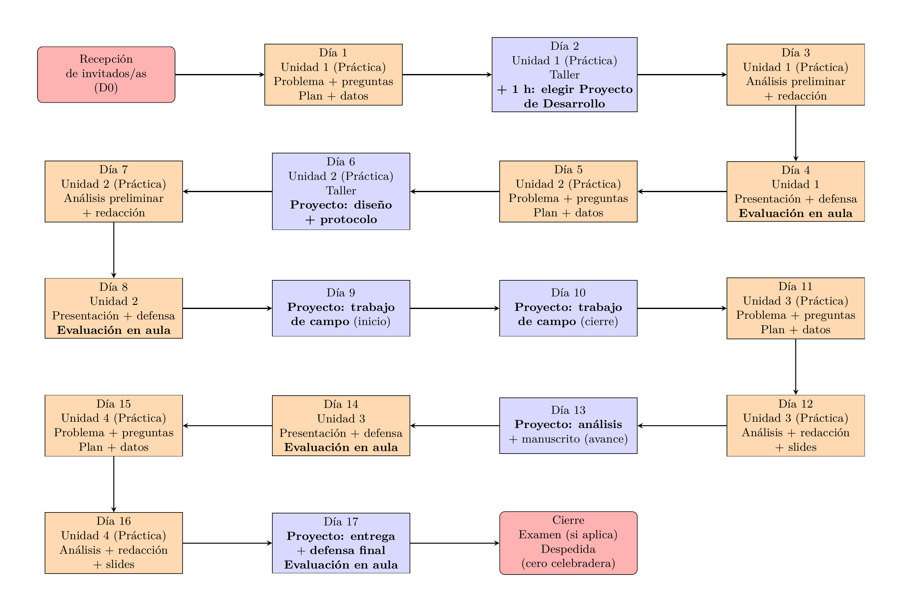

```{r setup, include=FALSE}
knitr::opts_chunk$set(
  echo = FALSE,
  warning = FALSE,
  message = FALSE,
  out.width="100%",
  fig.pos = 'H')
```

<!-- # Programa de la asignatura: Biogeografía -->

```{r children, child=c("basicos.Rmd")}
```

# Descripción

## Versión larga

Matriculaste biogeografía, bienvenida, bienvenido. Antes de profundizar en su contenido, hablemos de ciencia. Contrario a como se la ha concebido tradicionalmente, la ciencia es un proceso creativo y crítico, que despierta la curiosidad y la motivación e, idealmente, es una producción humana justa. Pero la ciencia está inmersa en una crisis, una de reproducibilidad que diezma su capacidad intrínseca para crear nuevo conocimiento, y que está convirtiéndola en una herramienta injusta.

Diariamente, en todo el mundo millones de personas dedican ingentes cantidades de horas a la investigación. Aun así, difícilmente un equipo de investigadores intenta reproducir los estudios de otros, ni intentan replicar protocolos usando nuevos datos. Se atribuye este déficit a que, al publicar resultados científicos, no se aportan ni las fuentes, ni los métodos empleados. Aunque el panorama está cambiando, la única forma de aumentar la reproducibilidad, pasa por compartir las fuentes y utilizar métodos reproducibles. En definitiva, para hacer ciencia, necesitamos abrir nuestros métodos, publicar nuestros protocolos.

La biogeografía no escapa a esta realidad, por lo que, su enseñanza, idealmente debería ser creativa, crítica, motivadora y justa. Como en cualquier disciplina, es necesario que aprendes sus fundamentos, los básicos y, sobre todo, aquellos que puedas reproducir. Al estudiar esta asignatura, intentarás contribuir a romper el círculo cerrado del conocimiento, empleando métodos, técnicas y herramientas abiertas. Para ello, las condiciones son que justifiques tus decisiones y expliques cómo usas cada herramienta.

Ahora sí, hablemos de biogeografía. Es la ciencia que intenta documentar y entender los patrones espaciales de la diversidad biológica. Modernamente estudia todos los patrones de variación geográfica y temporal de la diversidad biológica de elementos naturales (desde genes hasta comunidad y ecosistema) asociados a gradientes de variables tales como el área, el aislamiento, la latitud, la profundidad o la elevación. También se le suele definir como el estudio de la distribución de organismos, tanto en el presente como en el pasado. Aunque en términos prácticos ecología y biogeografía son disciplinas distintas, ambas están muy interconectadas. No en vano, los creadores de la teoría de la biogeografía insular señalaron "[nosotros] ... no podemos ver ninguna distinción real entre biogeografía y ecología" [@macarthur1967]

## Versión corta

Matriculaste biogeografía, bienvenida, bienvenido. Antes de profundizar en su contenido, hablemos de ciencia. La ciencia, incluida la biogeografía, atraviesa una crisis de reproducibilidad que afecta su capacidad para generar conocimiento nuevo y justo. Millones invierten tiempo en investigación, pero la falta de transparencia en métodos y fuentes dificulta la reproducibilidad y replicabilidad de las investigaciones. Aumentar la reproducibilidad requiere abrir nuestros métodos y publicar protocolos. En biogeografía, como en muchas otras disciplinas, la enseñanza debe ser creativa, crítica y que despierte la curiosidad, enfocándose en fundamentos que puedan reproducirse. Al estudiarla, en principio, deberías contribuir a un conocimiento abierto, justificando tus métodos y herramientas, facilitando al mismo tiempo la reproducibilidad. La biogeografía busca entender la distribución espacial y temporal de la diversidad biológica, desde genes hasta ecosistemas, en relación con variables como el área, el aislamiento y la latitud. Aunque se superpone con la ecología, son campos distintos pero interconectados. Los creadores de la teoría de la biogeografía insular incluso argumentaron que no veían "ninguna distinción real entre biogeografía y ecología" (MacArthur & Wilson, 1967). Ambas disciplinas, pese a sus enfoques diferentes, colaboran en entender la complejidad de la vida en la Tierra.

# Competencias de la asignatura

-	Creatividad y curiosidad, al plantear tus propios problemas de investigación, formular preguntas y responderlas empleando soluciones propias y mejorando o adaptando las existentes.

-	Criticismo, al cuestionar el desarrollo de esta disciplina, sus enfoques y sus paradigmas actuales.

-	Comunicación, al redactar de forma abierta, tus resultados de investigación y proponer tus interpretaciones.

-	Ciudadanía, apertura/transparencia, sentido de justicia y de igualdad, al contribuir con el conocimiento científico y al posibilitar la reproducibilidad de tus resultados.

# Resultados de aprendizaje esperados

Al finalizar la asignatura, estas afirmaciones deberían ser ciertas:

RAE1.	Formulas preguntas de investigación en biogeografía que puedes dejar planteadas.

RAE2.	Aplicas métodos y técnicas usados en biogeografía para analizar la biodiversidad y su distribución espacial, con énfasis en ecología numérica, utilizando datos de terreno y basándote en protocolos reproducibles.

RAE3.	Comprendes los principios geográficos y ecológicos de la biogeografía, así como los procesos biogeográficos y la historia de la biota en la Tierra.

# Organización del curso


```{r, warning=F, message=F, echo=F}
library(magick)

# Leer el PDF
pdf_img <- image_read_pdf("../esquema-comun-materias/esquema-comun-materias.pdf",
                          density = 300)  # density mejora resolución

# Guardar como JPG
image_write(pdf_img, path = "../presentaciones/esquema-comun-materias.jpg", format = "jpg")
```

{width=90%}

# Unidad 1. Fundamentos y contexto de la biogeografía

-   **Definiciones y alcance**: aplicaciones, preguntas en biogeografía, temas comunes e interdisciplinarios.

-   **Epistemología e historia**: reseña histórica de las ciencias naturales y sus implicaciones hacia la biogeografía.

-   **Fuentes de información**: revistas científicas y manuales habituales en biogeografía.

-   **Breve introducción a la ecología numérica**: *análisis exploratorio de datos* (AED o EDA, resúmenes estadísticos sobre la comunidad y las variables ambientales, mapas, paneles de correlación); *medición de asociación*, modos de análisis Q y R, paradoja de Orlóci; *análisis de agrupamiento (cluster analysis)*, agrupamiento jerárquico, interpretación y comparación de resultados, grupos (clústers), especies indicadoras, especies con preferencia por hábitats; *análisis de ordenación*, ordenación simple (no restringida) y ordenación canónica (restringida); *análisis de diversidad*, diversidad alpha, diversidad beta; *ecología espacial*, análisis espacial de datos ecológicos, autocorrelación, modelos de distribución de especies.

# Unidad 2. La "plantilla" geográfica, factores físicos y ambientales

- **Introducción**: definiciones, elementos comunes, importancia para el análisis biogeográfico, nociones básicas de cartografía.

-   **Clima**: balance energético, radiación electromagnética, fundamentos astronómicos, temperatura, circulación general atmosférica, humedad y precipitación, biomas determinados por el clima, variación del clima.

-   **Ambiente acuático**: agua en la Tierra, interacción con la luz, propiedades físicas y químicas en relación con la profundidad, ambientes de agua dulce.

-   **Ambiente terrestre**: constricciones físicas, luz, suelo.

# Unidad 3. Distribución, dinámica y evolución de la biodiversidad

-   **Distribución de especies**: ámbito (range) geográfico, individuos y poblaciones en los estudios de distribución, límites del ámbito, patrones derivados, predicción de ámbitos, "leyes".

-   **Distribución de comunidades**: definiciones, organización, comunidades en el tiempo y en el espacio, biomas terrestres, comunidades acuáticas, geografía de los ecosistemas.

-   **Dispersión e inmigración**: definiciones como procesos ecológicos, expansión del ámbito, mecanismos, barreras, establecimiento de colonias.

-   **Especiación y extinción**: definiciones, sistemática, macroevolución, evolución en el registro fósil.

# Unidad 4. Historia geológica, linajes, islas y biogeografía de La Española

-   **Cambios en la Tierra**: tiempo geológico, deriva de los continentes, expansión de los fondos oceánicos, tectónica de placas, modelo actual, consecuencias climáticas y biogeográficas de la tectónica de placas.

-   **Diversificación e historia de los linajes**: clasificación de la biodiversidad en el tiempo, inferencias sobre relaciones evolutivas, filogenética, filogeografía.

-   **Biogeografía insular**: islas en los estudios biogeográficos, importancia, patrones insulares, origen y justificación de la teoría del equilibrio, desarrollo más allá de la teoría clásica.

-   **Biogeografía de La Española**: origen geológico y configuración actual, diversidad de hábitats y especies endémicas, influencia de barreras físicas internas y relaciones biogeográficas con otras islas y el continente.

---

## Estrategias y actividades formativas

- **E1.** Estudio de casos de aplicación de la biogeografía.

- **E2.** Clase expositiva.  

- **E3.** Aprendizaje basado en problemas (ABP).  

- **E4.** Aprendizaje por descubrimiento e indagación.  

- **E5.** Salida de campo (si aplica), con colecta de datos propios.  

- **E6.** Tutorías regulares. **Lugar:** aula FC-203. **Días:** miércoles a viernes. **Horario:** 9 am a 1 pm (también disponibilidad por las tardes).  

---


## Evaluación de los aprendizajes

### Criterios

- Uso de técnicas y métodos reproducibles.

- Identificación y resolución de problemas de investigación en biogeografía, incluyendo colecta, procesamiento y análisis de datos de campo. 

- Aprovechamiento de recursos informáticos, tales como aplicaciones, programación, tutor de inteligencia artificial supervisado, para el análisis y síntesis de resultados.

- Síntesis de resultados de investigación en una pieza de investigación tipo manuscrito.

### Técnicas e instrumentos de evaluación

<br>

```{r}
library(flextable)

# Datos
evaluacion <- data.frame(
  No = c(1, 2, 3, 4, 5),
  Tecnicas = c(
    "Proyecto: redacción de manuscrito científico de biogeografía",
    "Formulación y resolución de problemas",
    "Ejercicios, prácticas/problemas de clase usando recursos básicos, analógicos",
    "Ejercicios, prácticas/problemas de clase usando recursos informáticos (aplicaciones, programación, tutor IA supervisado)",
    "Exámenes y exposiciones"
  ),
  Instrumentos = c(
    "Rúbricas, fichas de autoevaluación",
    "Rúbricas, fichas de autoevaluación",
    "Hoja de verificación de ejercicios y prácticas",
    "Hoja de verificación de ejercicios y prácticas",
    "Examen calificado/hoja de evaluación de presentación"
  ),
  stringsAsFactors = FALSE
)

# Flextable
flextable(evaluacion) |>
  set_header_labels(
    No = "No.",
    Tecnicas = "Técnicas",
    Instrumentos = "Instrumentos de Evaluación"
  ) |>
  width(j = 1, width = 0.5) |>   # columna Técnicas
  width(j = 2, width = 3) |>   # columna Técnicas
  width(j = 3, width = 3) |>   # columna Instrumentos
  fontsize(size = 10, part = "all") |>
  align(align = "center", part = "header")

```

---

## Distribución de puntaje

<br>

```{r}
# Datos
distribucion <- data.frame(
  Item = c(
    "Asistencia",
    "Prácticas de aula",
    "Prácticas de desarrollo",
    "Proyecto",
    "Exámenes y exposiciones"
  ),
  Porcentaje = c(
    "(max. 5%)",
    "(max. 20%)",
    "(min. 20, max. 30%)",
    "(min. 20%, max. 30%)",
    "(min. 20%, max. 30%)"
  ),
  stringsAsFactors = FALSE
)

ft <- flextable(distribucion) |>
  set_header_labels(
    Item = "Ítem",
    Porcentaje = "Porcentaje de la nota final"
  ) |>
  width(j = 1, width = 3.2) |>
  width(j = 2, width = 2.2) |>
  fontsize(size = 10, part = "all") |>
  align(align = "center", part = "header") |>
  align(j = 2, align = "right", part = "body") |>
  valign(valign = "top", part = "body") |>
  padding(padding = 2, part = "all") |>
  set_table_properties(layout = "fixed")
ft
```

---

## Recursos didácticos

- Mapas.

- Libros de texto y artículos científicos.

- Ejercicios resueltos.

- Vídeos en línea (clases y tutorías).

- Servidor de foros.

---

## Recursos tecnológicos

- Servidor de programación.

- Proyector en el aula.

- Computadora personal. Si no dispones de una, provisionalmente usa tu celular, aunque esta solución tiene limitaciones. La PC es necesaria para:

  - elaboración y consulta de mapas,
  
  - experimentación con simulaciones,
  
  - redacción científica,
  
  - análisis de datos mediante programación,
  
  - uso de tutor de IA de forma supervisada,
  
  - elaboración de presentaciones de diapositivas.

- Bases de datos y fuentes cartográficas digitales (imágenes satelitales, mapas web y locales).  

- Servicios en la nube de escala planetaria (**Google Earth Engine, Microsoft Planetary Computer**, entre otros).  

# Bibliografía

Borcard, D., Gillet, F., & Legendre, P. (2018). Numerical ecology with R. Springer.

Cámara, R. (1997): República Dominicana: Dinámica del medio físico en la región Caribe (Geografía Física, sabanas y litoral). Aportación al conocimiento de la tropicalidad insular. Tesis doctoral de la Universidad de Sevilla.

Krebs, C. J. (1999). Ecological methodology (Vol. 620). Menlo Park, California: Benjamin/Cummings.

Lomolino, M.V., Riddle, B.R, Whittaker, R., Brown, J.H. (2010). Biogeography. Fourth Edition. Sinauer Associates, Inc.

MacArthur, R. H. (1984). Geographical ecology: patterns in the distribution of species. Princeton University Press.

MacArthur, R. H., & Wilson, E. O. (1967). The theory of island biogeography. Princeton Monographs in Population Biology.

Magurran, A. E. (2013). Measuring biological diversity. John Wiley & Sons.

Martínez-Batlle, J. R. (2020). Scripts de análisis de la asignatura "Biogeografía (GEO-1310) de la Universidad Autónoma de Santo Domingo (biogeografia-master/scripts-de-analisis-BCI: Long coding sessions) (v0.0.0.9000) [Software]. Zenodo: https://doi.org/10.5281/ZENODO.4402362 GitHub: https://github.com/biogeografia-master/scripts-de-analisis-BCI

Martínez-Batlle, J. R. (2019-2023). Material de apoyo de las ediciones 2019-2023 de la asignatura "Biogeografía (GEO-1310) de la Universidad Autónoma de Santo Domingo. GitHub: https://github.com/biogeografia-master/material-de-apoyo

Smith, T., & Smith, R. (2007). Ecología (6 edición). Pearson.

# Bibliografía complementaria

Brown, A. D. (2001). Bosques nublados del neotrópico. M. Kappelle (Ed.). San José: Instituto Nacional de Biodiversidad.

Cámara, R; Martinez, J.R.; Díaz del Olmo, F. (2005): Desarrollo sostenible y Medio Ambiente en República Dominicana. Medios Naturales, manejo histórico, conservación y protección. Escuela de Estudios Hispano-Americanos (CSIC) y Universidad de Sevilla. Madrid. 280 págs.

Chapin III, F. S., Chapin, M. C., Matson, P. A., & Vitousek, P. (2011). Principles of terrestrial ecosystem ecology. Springer.

Ciferri, R. (1936): Studio geobotánica dell'isola Hispaniola (Antille). Universitá di Pavía. Volume VIII, Serie IVa. 336 págs. Pavia.

Clements, F.E. (1902): A system of Nomenclature for Phytogeography Botanische Jahrbucher fur Systematik, Pflanzengeschichte und Pflanzengeographie 31 (Beibl.70): 1-20.

Clements, F.E. (1920): Plant indicators : the relation of plant communities to process and practice. Washington Carnegie Institution of Washington.

Cochrane, M. (2010). Tropical fire ecology: climate change, land use and ecosystem dynamics. Springer

Condit, R., Ashton, P. S., Manokaran, N., LaFrankie, J. V., Hubbell, S. P., & Foster, R. B. (1999). Dynamics of the forest communities at Pasoh and Barro Colorado: comparing two 50–ha plots. Philosophical Transactions of the Royal Society of London. Series B: Biological Sciences, 354(1391), 1739-1748.

Condit, R., Hubbell, S. P., Lafrankie, J. V., Sukumar, R., Manokaran, N., Foster, R. B., & Ashton, P. S. (1996). Species-area and species-individual relationships for tropical trees: a comparison of three 50-ha plots. Journal of Ecology, 549-562.

Dansereau, P. (1957). Biogeography. An ecological perspective. Biogeography. An ecological perspective.

Duchaufour, Ph. (1984): Edafología. 1. Edafogénesis y clasificación. Pp. 3-68

Ferreras, C. (2000): Factores mesológicos de la vegetación. En:  Meaza, G. Ed.; Metodología y práctica de la Biogeografía. Ediciones serbal. Barcelona. pp. 25-49

Guerrero, Ángela, E. (1993). Magnolia hamorii. La flora y la vegetación asociadas en la parte oriental de la sierra de Bahoruco, República Dominicana. Moscosoa. Vol. 7, p. 127-152

Harms, K. E., Condit, R., Hubbell, S. P., & Foster, R. B. (2001). Habitat associations of trees and shrubs in a 50‐ha neotropical forest plot. Journal of Ecology, 89(6), 947-959.

Harte, J. (2011). Maximum entropy and ecology: a theory of abundance, distribution, and energetics. Oxford University Press.

Hayek, L. A. C., & Buzas, M. A. (2010). Surveying natural populations: quantitative tools for assessing biodiversity. Columbia University Press.

Horn, S.P., Kennedy, L.M., and Orvis, K.H. Vegetation recovery following a high elevation fire in the Dominican highlands. Biotropica. 2001. Vol. 33, p. 701–708.

Horn, S.P., Orvis, K.H., Kennedy, L.M., and Clark, G.M. (2000). Prehistoric fires in the highlands of the Dominican Republic: evidence from charcoal in soils and sediments. Caribbean Journal of Science. Vol. 36, p. 10–18.

Horvát, S., Derzsi, A., Néda, Z., & Balog, A. (2010). A spatially explicit model for tropical tree diversity patterns. Journal of theoretical biology, 265(4), 517-523.

Howard, J. A., & Mitchell, C. W. (1985). Phytogeomorphology. John Wiley & Sons.

Huguet del Villar, E. (1929): Geobotánica. Colección Labor. Sección XII, Ciencias Naturales, nº 199-200. Barcelona. 340 p.

Humboldt, A. (1807). Essai sur la Geographie des plantes. Paris. 

Kennedy, L.M. , and Horn, S.P. (2008). Postfire vegetation recovery in highland pine forests of the Dominican Republic. Biotropica. Vol. 40, p. 412–421. 

Kennedy, L.M., Horn, S.P., and Orvis, K.H. (2006). A 4000-yr record of fire and forest history from Valle de Bao, Cordillera Central, Dominican Republic. Palaeogeography, Palaeoclimatology, Palaeoecology. Vol. 231, p. 271–290.

Kindt, R., & Coe, R. (2005). Tree diversity analysis: a manual and software for common statistical methods for ecological and biodiversity studies. World Agroforestry Centre.

Koleff, P., Gaston, K. J., & Lennon, J. J. (2003). Measuring beta diversity for presence–absence data. Journal of Animal Ecology, 72(3), 367-382.

Krebs, C. J. (1989). Ecological methodology (No. QH541. 15. S72. K74 1999.). New York: Harper & Row.

Lacoste, A.; Salanon, R. (1981): Biogeografía. Oikos Tau. Barcelona. 272. págs. (pp. 89-188)

Ladle, R. J., & Whittaker, R. J. (Eds.). (2011). Conservation biogeography. John Wiley & Sons.

Lehner, P. N. (1996). Handbook of ethological methods. Cambridge University Press.

Lomolino, M. (2000). A call for a new paradigm of island biogeography. Global Ecology and Biogeography, 9(1), 1-6.

Lomolino, M. V., Sax, D. F., & Brown, J. H. (Eds.). (2004). Foundations of biogeography: classic papers with commentaries. University of Chicago Press.

Margalef, R. (1986): Ecología. Omega. Barcelona. 952 págs. (pp. 15-236)

Martínez B., J.R. (2012). Sierra de Bahoruco Occidental, República Dominicana: estudio biogeomorfológico y estado de conservación de su parque nacional. Sevilla: tesis doctoral de la Universidad de Sevilla. 536 p

Matthews, T., Whittaker, R. (2014): Fitting and comparing competing models of the species abundance distribution: assessment and prospect. Frontiers of Biogeography, 6(2).

Meaza, G. (2000): Metodología y práctica de la Biogeografía. Ediciones Serval. 394 págs

Merckx, V. (2012). Mycoheterotrophy: The Biology of Plants Living on Fungi. Springer.

Meyer, V., Saatchi, S. S., Chave, J., Dalling, J. W., Bohlman, S., Fricker, G. A., … & Hubbell, S. (2013). Detecting tropical forest biomass dynamics from repeated airborne lidar measurements. Biogeosciences, 10(8), 5421.

Montero de Burgos, J.L.; García Salmerón, J. (1981): Atmósfera, I. El Clima. En: Tratado de Medio Ambiente, Tomo II. Universidad Politécnica de Madrid. CEOTMA, INTA, ICONA. Madrid.

Montero de Burgos, J.L.; González, J.L. (1974): Diagramas bioclimáticos. ICONA. Ministerio de Agricultura. Madrid.

Myers, R. L., J. O’Brien, D. Mehlman & C. Bergh. (2004). Evaluación del Manejo del Fuego en los Ecosistemas de Tierras Altas de la República Dominicana. The Nature Conservancy—Fire Initiative Misc. Technical Report.

Oksanen, J. (2013). Vegan: ecological diversity. R Project.

Oksanen, J., Kindt, R., Legendre, P., O’Hara, B., Stevens, M. H. H., Oksanen, M. J., & Suggests, M. A. S. S. (2007). The vegan package. Community ecology package.

Organización de Estados Americanos (OEA) (1967). Reconocimiento y Evaluación de los Recursos Naturales de la República Dominicana. Estudio para su Desarrollo y Planificación. Washington. 539 p.

Parenti, L. R., & Ebach, M. C. (2009). Comparative biogeography: discovering and classifying biogeographical patterns of a dynamic Earth (Vol. 2). Univ of California Press.

Raunkjaër, C. (1907): Types biologiques pour la géographie botanique. Ov. K. Danske Vid. Selsk. Forh.

Rivas-Martínez, S.  (2004), Worldwide Bioclimatic Classification System, Phytosociological Research Center, Spain. www.globalbioclimatics.org

Robbins, A. M. J., Eckelmann, C. M., & Quinones, M. (2008). Forest fires in the insular Caribbean. AMBIO: A Journal of the Human Environment, 37(7), 528-534.

Roth, L. C. (1999). Anthropogenic change in subtropical dry forest during a century of settlement in Jaiqui Picado, Santiago Province, Dominican Republic. Journal of Biogeography, 26(4), 739-759.

Stevens, M. H. (2009). A Primer of Ecology with R. Springer.

Tolentino, L., & Peña, M. (1998). Inventario de la vegetación y uso de la tierra en la República Dominicana. Moscosoa, 10, 179-203.

Van der Valk, A. (2009). Forest ecology: recent advances in plant ecology. Springer.

Wheater, C. P., Bell, J. R., & Cook, P. A. (2011). Practical field ecology: a project guide. John Wiley & Sons.

# Referencias citadas
